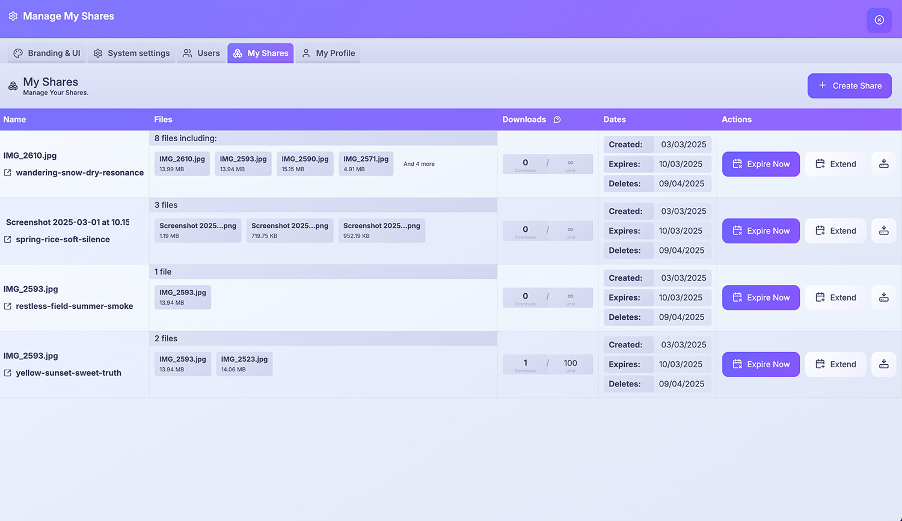

    

[](https://discord.gg/M74X2wmqY8)

# erugo

erugo is a powerful, self-hosted file-sharing platform built with PHP and Laravel with a Vue.js frontend. It offers secure, customisable file-transfer capabilities through an elegant user interface, giving you complete control over your data while providing a seamless experience for both senders and recipients.

## Demo

Check out a sample share on our demo site at [demo.erugo.app/shares/tight-silence-sweet-sea](https://demo.erugo.app/shares/tight-silence-sweet-sea). While uploads are disabled on the demo, you can experience the recipient's view and download the sample file.

Please note we're running the demo on a very cheap VPS so it may take a few seconds to load. This isn't an indication of the performance of the software, just our budget ;).

[](https://ko-fi.com/B0B11BF8EC)

## Screenshots


_A clean, intuitive upload interface showing file selection and recipient information_


_My Shares page showing share details and options to manage user's shares_


_Comprehensive settings page to configure the application_

## Videos Featuring Erugo

- ["Erugo - Self-Hosted File Sharing Platform" by DB Tech](https://www.youtube.com/watch?v=zqipBHSSPm4)
- ["Ditch WeTransfer! Self-Host Erugo for Secure File Sharing with Docker" by KeepItTechie](https://www.youtube.com/watch?v=FrcBALXDIRU)

## Community Content
- [Installer erugo avec Docker (french)](https://belginux.com/installer-erugo-avec-docker/)

## Key Features

- **Effortless Deployment**: Easy to deploy on Docker with the provided docker-compose file
- **Zero-Configuration**: Reasonable defaults out of the box, but easily customised via the web interface
- **Human-Friendly Share Links**: Easy-to-read URLs like `you.com/shares/quiet-cloud-shrill-thunder`
- **Secure Access Control**: Only authorized users can create shares, while anyone with a share link can download
- **Simple Data Management**: SQLite database for efficient metadata storage
- **Flexible Configuration**: Configure maximum share size, branding, expiry, and more
- **Easy User Management**: Invite and remove users from the web interface
- **Interactive Setup**: User-friendly first-run configuration when the web interface is first loaded
- **Modern Interface**: Clean, intuitive web UI
- **Open Source**: MIT licensed and ready for white-labeling
- **Translations**: Erugo is fully translatable and supports multiple languages already

## Star History

Give this repository a star to keep track of releases and updates. Stars are also great for motivating me to keep adding features!

[](https://star-history.com/#DeanWard/erugo&Date)

## Quick Start

You can use the example docker-compose.yaml below to run erugo in a container.

```
services:
  app:
    image: wardy784/erugo:latest
    restart: unless-stopped
    volumes:
      - ./storage:/var/www/html/storage
    ports:
      - "9998:80"
    networks:
      - erugo

networks:
  erugo:
    driver: bridge
```

The above docker-compose.yml provides a basic configuration starting point that will get erugo up and running with a default sqlite database.

```sh
docker compose up -d
```

## Configuration Options

erugo can be customised via the web interface.

- General settings
  - Application name
  - Application URL
  - Login message
  - Default language
  - Enable language selector
- Share settings
  - Maximum share size
  - Expiration time
  - Cleanup delay (how long after expiration the share is deleted)
- Notifications
  - Enabale / disable various notifications
- SMTP settings
  - SMTP host
  - SMTP port
  - SMTP encryption
  - SMTP username
  - SMTP password
  - SMTP from name
- Branding
  - Background images
  - Custom logo image and size
  - Hide powered by erugo text
  - Select themes
  - Manage themes


## Using erugo

### Creating a Share

1. Log in to the web interface
2. Select files for upload
3. Share the generated link with your recipient

### Downloading Files

Recipients simply need to:

1. Click the share link
2. Download the files through the web interface

### Manage your shares

1. Log in to the web interface
2. Click on the cog icon in the bottom right corner
3. Click on the "My Shares" tab

You can extend share expiration, expire shares, set maximum downloads, and more.

## Customization

As an open-source project, erugo can be tailored to your needs:

- Customize the UI to match your brand
- Modify URL structures and authentication methods
- Extend functionality through code modifications

## Translations

Currently, the following languages are supported:
- English
- French (Thanks to [@zarev](https://github.com/zarevskaya) & [@thibdevan](https://github.com/thibdevan))
- German
- Italian
- Spanish
- Dutch

Erugo is fully translatable. If you would like to contribute a translation, please join our [Discord server](https://discord.gg/M74X2wmqY8) and drop a message in general channel.

## Development

erugo is a Laravel application and uses Laravel Sail to run the development environment.

Run the following commands to start the server, run migrations, ans start vite in dev mode.

```sh
composer install
npm install
sail up -d
sail artisan migrate
sail artisan db:seed
npm run dev
```

## Build it yourself

To build the docker image yourself, run the following command.

```sh
docker build -t erugo:local -f docker/alpine/Dockerfile .
```
If you would like to push the image to Docker Hub, run the following command. You will need to have a Docker Hub account and be logged in.
```sh
DOCKER_HUB_USERNAME=<your-docker-hub-username> ./publish-docker-image.sh
```

## Contributing

We welcome community contributions! Feel free to:

- Submit bug reports and feature requests
- Translate erugo to your language
- Create pull requests
- Engage in discussions

## License

erugo is released under the MIT License, ensuring maximum flexibility for both personal and commercial use.

---

🚀 **Ready to start? Download erugo and begin sharing files securely in minutes!**

## Disclaimer

### Intended Use
erugo is designed for legitimate file-sharing purposes such as transferring work assets, design files, media content, and other non-sensitive data between trusted parties. It is not intended for sharing illegal, harmful, or unauthorized content.

### Administrator Responsibility
As a self-hosted application, administrators who deploy erugo are solely responsible for:
- Compliance with all applicable local, national, and international laws
- Proper configuration and security of their instance
- Monitoring and moderating the content shared through their instance
- Implementing appropriate terms of service for their users

### No Warranty
ERUGO IS PROVIDED "AS IS", WITHOUT WARRANTY OF ANY KIND, EXPRESS OR IMPLIED, INCLUDING BUT NOT LIMITED TO THE WARRANTIES OF MERCHANTABILITY, FITNESS FOR A PARTICULAR PURPOSE AND NONINFRINGEMENT. IN NO EVENT SHALL THE AUTHORS OR COPYRIGHT HOLDERS BE LIABLE FOR ANY CLAIM, DAMAGES OR OTHER LIABILITY, WHETHER IN AN ACTION OF CONTRACT, TORT OR OTHERWISE, ARISING FROM, OUT OF OR IN CONNECTION WITH THE SOFTWARE OR THE USE OR OTHER DEALINGS IN THE SOFTWARE.

### Recommended Practices
We strongly recommend that administrators:
- Implement access controls to limit who can create shares
- Configure appropriate file size limits
- Set reasonable expiration periods for shares
- Regularly review system logs
- Consider implementing additional monitoring if deploying in production environments

By downloading, installing, or using erugo, you acknowledge that you have read and understood this disclaimer.
