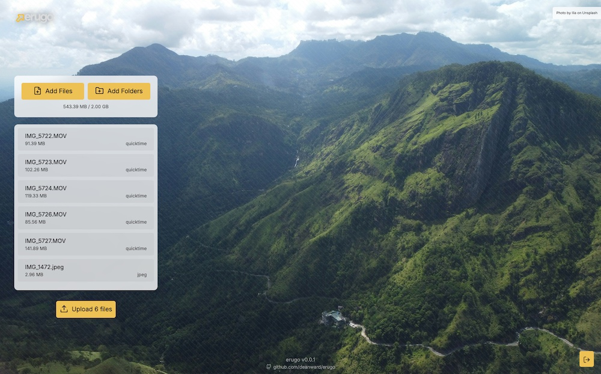
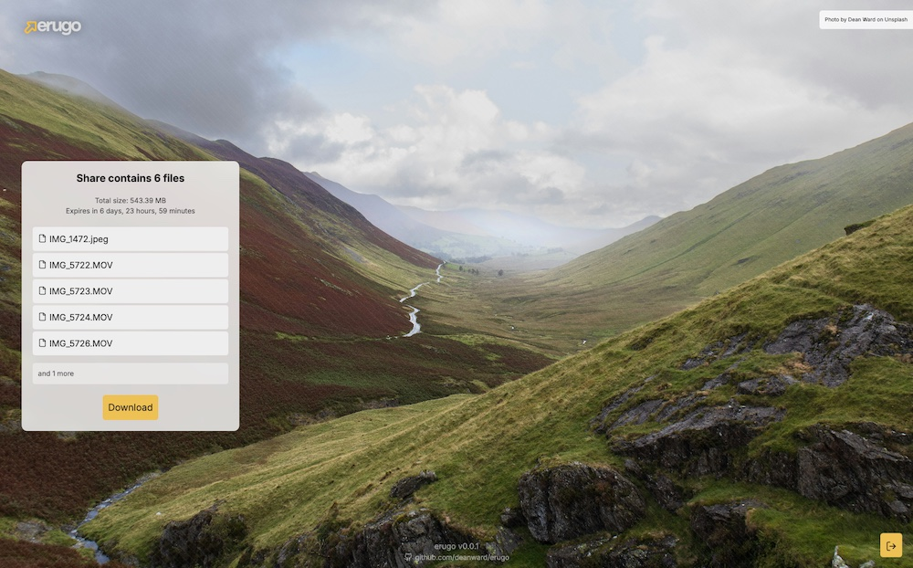
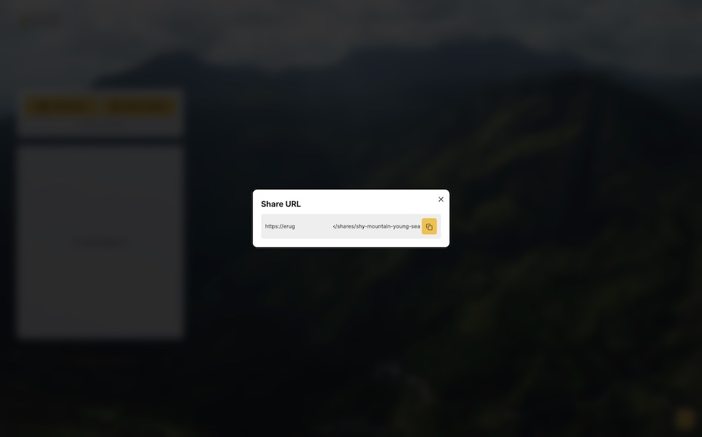

# erugo

[](https://github.com/DeanWard/erugo/actions/workflows/build.yml) 


erugo is a secure, self-hosted alternative to WeTransfer, built with Go and Vue.js. It combines powerful file-sharing capabilities with a sleek user interface, all packaged in a single, easy-to-deploy binary.

[See it on DB Tech on YouTube](http://youtube.com/watch?v=zqipBHSSPm4)

## Screenshots


*A clean, intuitive upload interface showing file selection and progress*


*Share details view with file listing and expiration information*


*Simple one-click share URL copying*


# Key Features

- **Effortless Deployment**: Single binary contains both backend and frontend
- **Human-Friendly Share Links**: Easy-to-read URLs like `https://yourdomains.com/shares/patient-haze-tiny-term`
- **Secure Access Control**: Only authorized users can create shares, while anyone with a share link can download
- **Simple Data Management**: SQLite database for efficient metadata storage
- **Flexible Configuration**: Customizable storage paths and share size limits
- **Interactive Setup**: User-friendly first-run configuration when the web interface is first loaded
- **Modern Interface**: Clean, intuitive web UI
- **Open Source**: MIT licensed and ready for white-labeling

## Quick Start

1. Download the appropriate binary for your platform from the [Releases](https://github.com/DeanWard/erugo/releases/) page

2. For Mac/Linux systems, make the binary executable:
   ```sh
   chmod +x erugo-darwin-arm64
   ```

3. Launch erugo:
   ```sh
   ./erugo
   ```

4. Access the web interface at `http://localhost:9199` and complete the interactive first-run setup to create your admin account

## Docker

You can use the example docker-compose.yaml below to run erugo in a container.

```
services:
  erugo:
    image: wardy784/erugo:latest
    ports:
      - "9199:9199"  # The web interface will be available at http://localhost:9199
    volumes:
      - erugo-storage:/app/storage  # Persistent storage for shared files
      - erugo-private:/app/private  # Persistent storage for private files (e.g., logo)
    environment:
      - ERUGO_BASE_STORAGE_PATH=/app/storage
      - ERUGO_APP_URL=http://localhost:9199
      - ERUGO_BIND_PORT=9199
      - ERUGO_DATABASE_FILE_PATH=/app/private/erugo.db
      - ERUGO_MAX_SHARE_SIZE=2G
      - ERUGO_JWT_SECRET=change_this_to_a_secure_secret_in_production
      - ERUGO_PRIVATE_DATA_PATH=/app/private
    restart: unless-stopped  # Automatically restart the container

volumes:
  erugo-storage:  # Stores uploaded files
  erugo-private:  # Stores private files including the .db and logo.png
```

The above docker-compose.yml creates a volume for the storage and private data directories, it stores the database and logo in the private volume. Uploaded files are separately stored in the storage volume.

```sh
docker compose up -d
```

## Configuration Options

erugo can be customized through a configuration file or environment variables with the following options:

| Option              | Environment Variable      | Description                               | Default Value           |
|--------------------|---------------------------|-------------------------------------------|------------------------|
| `app_url`          | `ERUGO_APP_URL`          | Application hosting URL                   | `http://localhost:9199` |
| `base_storage_path`| `ERUGO_BASE_STORAGE_PATH`| File storage location                     | `storage`              |
| `max_share_size`   | `ERUGO_MAX_SHARE_SIZE`   | Maximum file size per share              | `2G`                   |
| `bind_port`        | `ERUGO_BIND_PORT`        | Web server port                          | `9199`                 |
| `jwt_secret`       | `ERUGO_JWT_SECRET`       | JWT authentication secret                 | `change_me`            |
| `database_file_path` | `ERUGO_DATABASE_FILE_PATH` | Database file location                  | `erugo.db`             |
| `private_data_path` | `ERUGO_PRIVATE_DATA_PATH` | Private data storage location            | `/private`             |

A default `config.json` file is automatically generated on first run.

## Using erugo

### Creating a Share
1. Log in to the web interface
2. Select files for upload
3. Share the generated link with your recipient

### Downloading Files
Recipients simply need to:
1. Click the share link
2. Download the files through the web interface

## Customization

As an open-source project, erugo can be tailored to your needs:
- Customize the UI to match your brand
- Modify URL structures and authentication methods
- Extend functionality through code modifications

## Build it yourself

To build erugo yourself, you will need to have Go installed.

```sh
git clone https://github.com/DeanWard/erugo.git
cd erugo
make build
```

This will build both the front end and the backend, merged into a single binary which will be placed in the root of the repo.
By default the binary will be built for the current platform, but you can specify a different platform with the `GOOS` and `GOARCH` variables.

## Run the dev servers

```sh
make run
```
This will start the backend server on port 9199 and the frontend server on port ~ 5173 using vite.

## Roadmap

I'm actively developing erugo with the following features planned:

- **UI-Based White-Labeling**: Brand customization through the web interface
- **Enhanced File Access**: Optional direct file downloads without ZIP packaging
- **Flexible Database Configuration**: Configurable database file location
- **Docker Support**: Containerized deployment option

## Contributing

We welcome community contributions! Feel free to:
- Submit bug reports and feature requests
- Create pull requests
- Engage in discussions

## License

erugo is released under the MIT License, ensuring maximum flexibility for both personal and commercial use.

---

🚀 **Ready to start? Download erugo and begin sharing files securely in minutes!**
