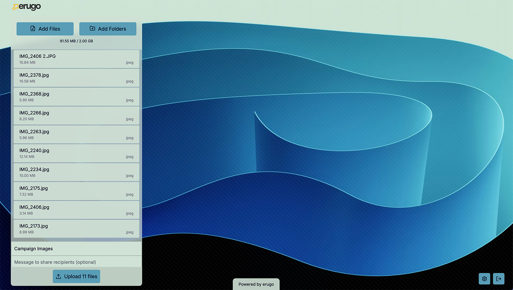
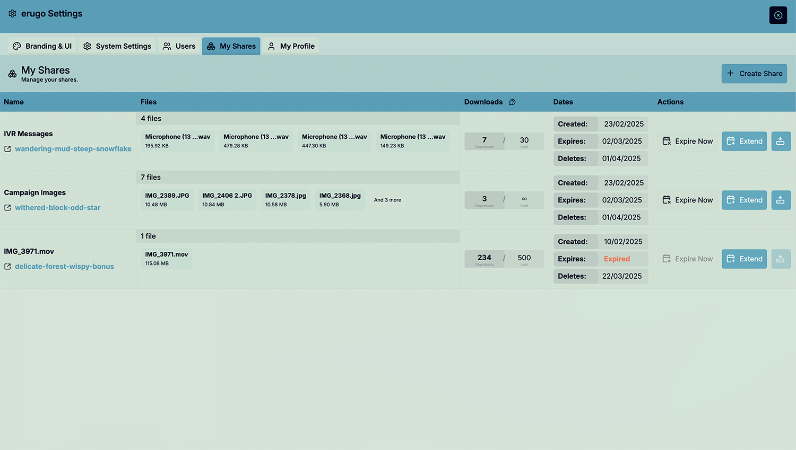

# erugo

erugo is a secure, self-hosted alternative to WeTransfer, built with PHP and Laravel with a Vue.js frontend. It combines powerful file-sharing capabilities with a sleek user interface.

## Screenshots


_A clean, intuitive upload interface showing file selection and progress_


_Share details view with file listing and expiration information_


_Manage shares with ease, including share expiration, maximum downloads, and more_

# Key Features

- **Effortless Deployment**: Easy to deploy on Docker with the provided docker-compose file
- **Human-Friendly Share Links**: Easy-to-read URLs like `https://yourdomain.com/shares/quiet-cloud-shrill-thunder`
- **Secure Access Control**: Only authorized users can create shares, while anyone with a share link can download
- **Simple Data Management**: SQLite database for efficient metadata storage
- **Flexible Configuration**: Configure maximum share size, branding, expiry, and more
- **Interactive Setup**: User-friendly first-run configuration when the web interface is first loaded
- **Modern Interface**: Clean, intuitive web UI
- **Open Source**: MIT licensed and ready for white-labeling

## Quick Start

You can use the example docker-compose.yaml below to run erugo in a container.


> **⚠️ WARNING: COMING FROM THE GO VERSION? READ THIS ⚠️**
> 
> If you are migrating from the Go version of erugo, please be aware that there are significant changes in the architecture and configuration. The new version is built with PHP and Laravel and is entirely incompatible with the Go version. Set this up as a brand new installation.


```
services:
  app:
    image: wardy784/erugo:latest
    restart: unless-stopped
    volumes:
      - ./storage:/var/www/html/storage
    ports:
      - "9998:80"
    networks:
      - erugo

networks:
  erugo:
    driver: bridge
```

The above docker-compose.yml provides a basic configuration starting point that will get erugo up and running with a default sqlite database.

```sh
docker compose up -d
```

## Configuration Options

erugo can be customized via the web interface.

- General settings
  - Application name
  - Login message
- Share settings
  - Maximum share size
  - Expiration time
  - Cleanup delay (how long after expiration the share is deleted)
- Branding
  - Background images
  - Custom logo image and size
  - Hide powered by erugo text
  - Manage user interface colors
- SMTP settings _(not implemented yet)_
  - SMTP host
  - SMTP port
  - SMTP encryption
  - SMTP username
  - SMTP password
  - SMTP from name

## Using erugo

### Creating a Share

1. Log in to the web interface
2. Select files for upload
3. Share the generated link with your recipient

### Downloading Files

Recipients simply need to:

1. Click the share link
2. Download the files through the web interface

### Manage your shares

1. Log in to the web interface
2. Click on the cog icon in the bottom right corner
3. Click on the "My Shares" tab

You can extend share expiration, expire shares, set maximum downloads, and more.

## Customization

As an open-source project, erugo can be tailored to your needs:

- Customize the UI to match your brand
- Modify URL structures and authentication methods
- Extend functionality through code modifications

## Development

erugo is a Laravel application and uses Laravel Sail to run the development environment.

Run the following commands to start the server, run migrations, ans start vite in dev mode.

```sh
sail up -d
sail artisan migrate
sail artisan db:seed
npx vite
```

## Build it yourself

To build the docker image yourself, run the following command.

```sh
docker build -t erugo:local -f docker/alpine/Dockerfile .
```
If you would like to push the image to Docker Hub, run the following command. You will need to have a Docker Hub account and be logged in.
```sh
DOCKER_HUB_USERNAME=<your-docker-hub-username> ./publish-docker-image.sh
```

## Contributing

We welcome community contributions! Feel free to:

- Submit bug reports and feature requests
- Create pull requests
- Engage in discussions

## License

erugo is released under the MIT License, ensuring maximum flexibility for both personal and commercial use.

---

🚀 **Ready to start? Download erugo and begin sharing files securely in minutes!**
